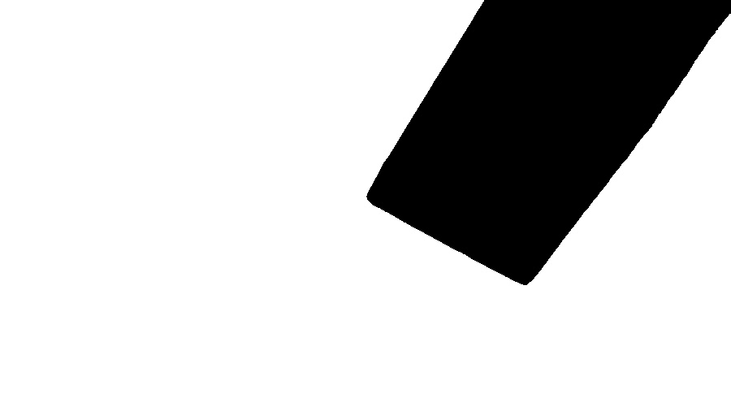
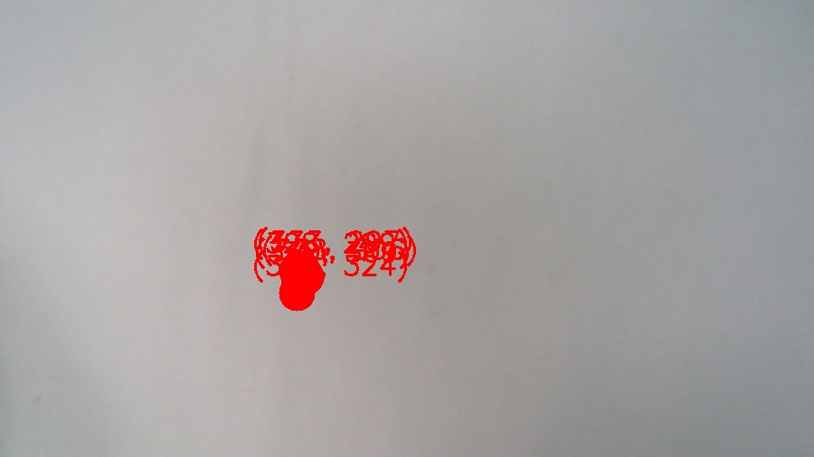

# coding_AiProjcet
파이썬을 이용한 코딩 교구 제작

----
# 이미지 전처리
* 원본이미지

  

원본이미지를 gray 스케일로 변경한다.## PI1

  

이미지에 블러효과를 주어 잡티를 제거한다. ## PI2

  

이진화를 진행한다. ## PI3

  

이미지에서 교구의 꼭짓점을 찾는다. ## PI4

  

구한 꼭짓점을 기준으로 이미지를 평면화 시켜준다. ## PI5

  

이미지에서 방향과 숫자 부분을 따로 크롭하여 모델에 들어갈 수 있는 사이즈로 변경해준다. ## PI6, PI7

  

  

